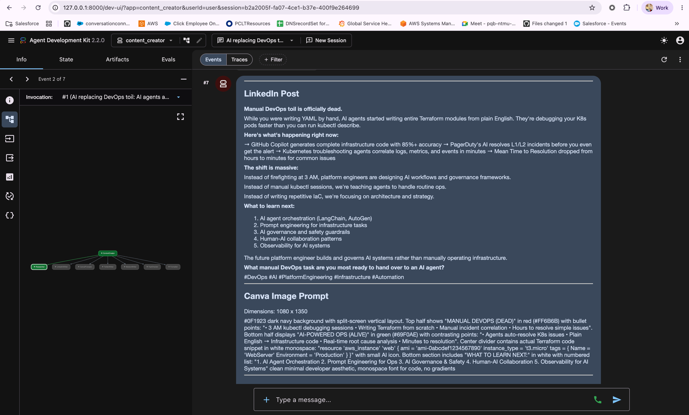

# Content Creator — Multi-Agent AI Pipeline

A multi-agent content generation tool built with [Google ADK](https://github.com/google/adk-python) that produces LinkedIn posts, Twitter/X threads, Medium articles, and Canva image prompts from a single topic.

Powered by Anthropic Claude via LiteLLM adapter.

## Pipeline

```
Topic → Researcher → LinkedIn Writer → Canva Prompter → Twitter Writer → Medium Writer → Fact Checker → Formatter
```

| Agent | Output |
|-------|--------|
| **Researcher** | Technical brief (DevOps + AI topics), reads from `latest_news.json` |
| **LinkedIn Writer** | 150-300 word post (hook → structured breakdown → takeaway) |
| **Canva Prompter** | Dense paragraph prompt for Canva's AI template generator (1080x1350) |
| **Twitter Writer** | 6-8 tweet thread, 280 chars each, numbered |
| **Medium Writer** | 1200-1800 word technical blog post |
| **Fact Checker** | Validates YAML, versions, code syntax, consistency |
| **Formatter** | Presents all outputs in one response |

## Quick Start

```bash
# 1. Clone and setup
git clone https://github.com/ShubhamArora073/content-creator.git
cd content-creator

# 2. Configure
cp .env.example .env
# Edit .env with your API key

# 3. Run
./start.sh
# Opens ADK Web UI at http://localhost:8000
```

## Screenshot



## Usage

In the ADK Web UI, try prompts like:

- `kubernetes user namespaces` — specific topic
- `what's latest in AI` — picks from fetched news
- `use latest news` — auto-selects trending topic
- `vibe coding is replacing traditional development` — opinionated take

## News Fetching

The researcher agent reads from `latest_news.json` for fresh topics.

```bash
# Manual fetch
python fetch_news.py

# Automated (add to crontab — runs every Monday 8:23 AM)
23 8 * * 1 cd ~/path/to/content-creator && .venv/bin/python fetch_news.py
```

**Sources:** Kubernetes Blog, CNCF Blog, Simon Willison's Blog, AI News (Buttondown), Claude Code GitHub Releases

## Canva Image Workflow

The Canva Prompter generates prompts with:
- 5 rotating visual themes (dark tech, gradient, clean white, warm dark, blueprint)
- 5 layout variations (before/after, vertical flow, radial, single statement, timeline)
- Exact text content (no placeholders)
- Verified code blocks

Paste the prompt into: Canva → Custom size (1080x1350) → Templates → Generate

## Requirements

- Python 3.11+
- An Anthropic API key (or compatible gateway)

## Project Structure

```
├── agent.py              # Multi-agent pipeline definition
├── fetch_news.py         # RSS news fetcher (cron-friendly)
├── start.sh              # One-command setup and launch
├── requirements.txt      # Python dependencies
├── .env.example          # Config template
├── .claude/commands/     # Claude Code skills
│   └── linkedin-post.md  # /linkedin-post skill
└── .github/workflows/
    └── lint.yml          # CI: ruff lint + import check
```

## License

MIT
